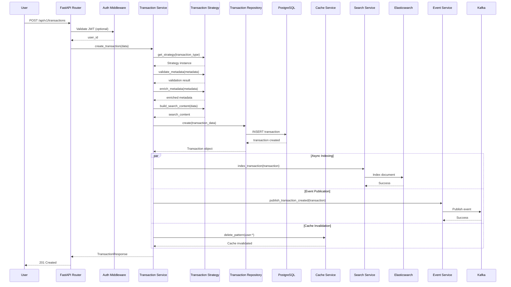
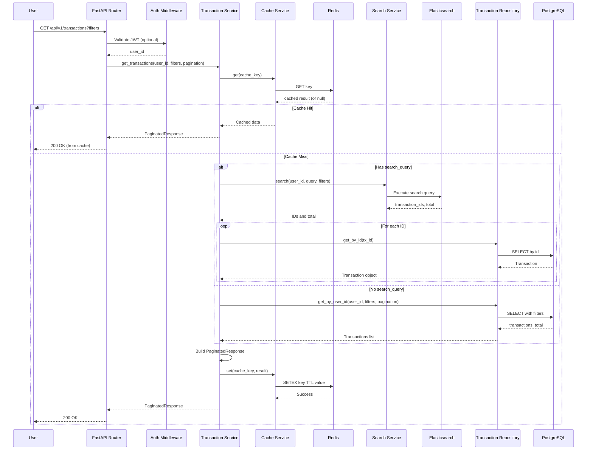
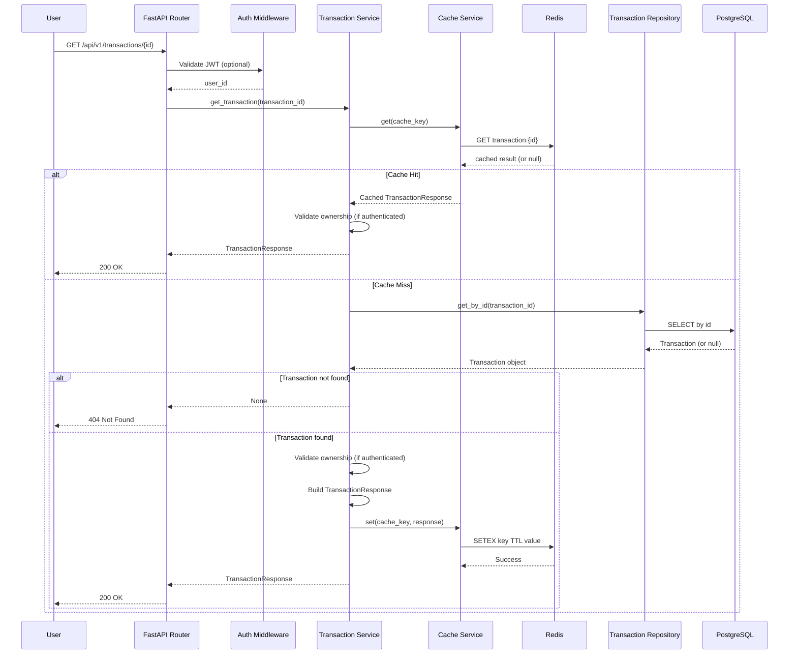
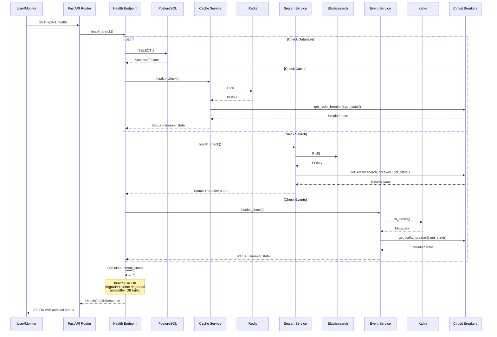
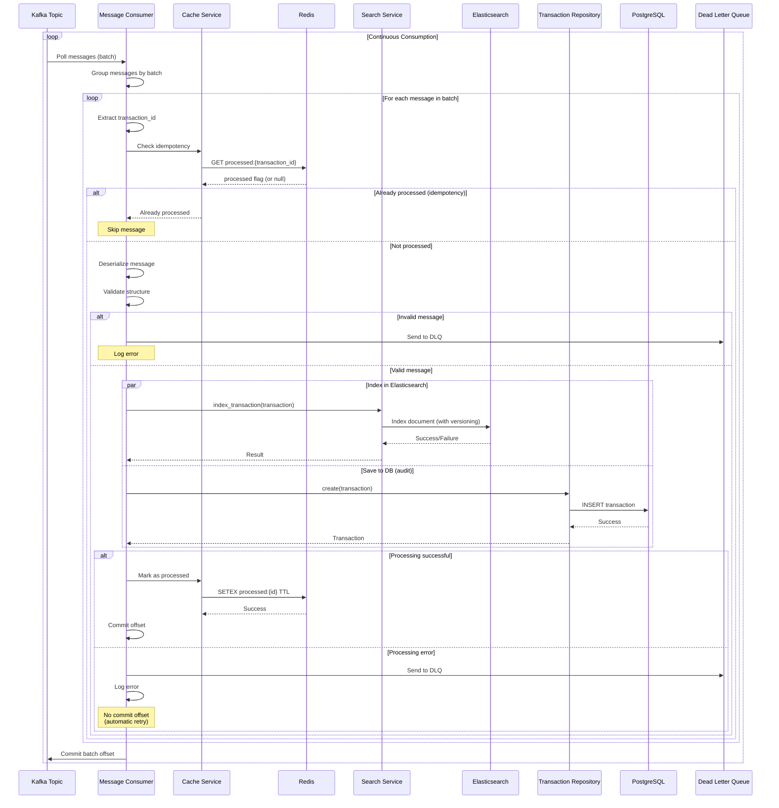

# AstroPay Activity Feed API

Unified Activity Feed API to consolidate all financial transactions from multiple microservices into a single source of truth.

## 🏗️ Architecture

### Main Components

1. **API Layer (FastAPI)**: RESTful endpoints with automatic validation
2. **Service Layer**: Business logic with separation of concerns
3. **Repository Pattern**: Data access abstraction
4. **Strategy Pattern**: Transaction type-specific processing
5. **Caching Layer (Redis)**: Cache to improve performance
6. **Search Layer (Elasticsearch)**: Advanced full-text search
7. **Event System (Kafka)**: Events for real-time updates
8. **Database (PostgreSQL)**: Primary storage with JSONB for flexible metadata

### Design Patterns Implemented

#### 1. Repository Pattern
- Abstracts data access from business logic
- Facilitates testing and implementation changes
- Location: `app/repositories/transaction_repository.py`

#### 2. Strategy Pattern
- Different strategies to process each transaction type
- Allows extensibility without modifying existing code
- Location: `app/strategies/transaction_strategy.py`

#### 3. Dependency Injection
- Services injected as dependencies
- Facilitates testing and maintenance
- Location: `app/api/dependencies.py`

### Resilience

#### 1. Circuit Breaker Pattern (Implicit)
- Services (Cache, Search, Events) automatically disable if they fail
- Application continues to function in degraded mode
- Health checks monitor the status of each service

#### 2. Graceful Degradation
- If Redis fails, the application works without cache
- If Elasticsearch fails, PostgreSQL search is used
- If Kafka fails, events are omitted but transactions are saved

#### 3. Connection Pooling
- PostgreSQL with configured connection pool
- Prevention of hanging connections with `pool_pre_ping`

#### 4. Retry Logic
- Elasticsearch with automatic retries
- Appropriate timeout configuration

### Performance

#### 1. Caching
- Redis to cache results of frequent queries
- Configurable TTL (default: 5 minutes)
- Automatic invalidation when creating/updating transactions

#### 2. Indexing
- Indexes in PostgreSQL for common queries:
  - `user_id` + `created_at` (composite)
  - `transaction_type` + `status`
  - `product` + `currency`
- Full-text index on `search_content`

#### 3. Hybrid Search
- Elasticsearch for complex and full-text searches
- PostgreSQL for standard filters
- Automatic fallback if Elasticsearch is unavailable

#### 4. Efficient Pagination
- Cursor-based pagination support
- Configurable page limits
- Optimized queries with `OFFSET` and `LIMIT`

#### 5. Async Processing
- Elasticsearch indexing does not block the response
- Events published asynchronously

## 📊 C4 Flow Diagrams

### Level 1: System Context

```mermaid
graph TB
    subgraph "System Context"
        User[👤 User<br/>Client consuming the API]
        API[🌐 Activity Feed API<br/>Unified API for financial transactions]
        Microservices[🔌 Microservices<br/>Services generating transactions]
    end
    
    User -->|Query and create transactions<br/>HTTPS/REST| API
    Microservices -->|Publish transaction events<br/>Kafka| API
    
    style User fill:#e1f5ff
    style API fill:#fff4e1
    style Microservices fill:#ffe1f5
```



### Level 2: Containers

```mermaid
graph TB
    subgraph "Activity Feed System"
        API[🚀 FastAPI Application<br/>Python/FastAPI<br/>REST API with automatic validation]
        Consumer[📨 Kafka Consumer<br/>Python<br/>Message consumer for indexing]
    end
    
    User[👤 User]
    Postgres[(🗄️ PostgreSQL<br/>Primary database with JSONB)]
    Redis[(💾 Redis<br/>In-memory cache)]
    Elasticsearch[(🔍 Elasticsearch<br/>Full-text search engine)]
    Kafka[📬 Kafka<br/>Event messaging system]
    
    User -->|HTTPS REST API| API
    API -->|Read and write<br/>SQLAlchemy| Postgres
    API -->|Read and write<br/>Redis Client| Redis
    API -->|Index and search<br/>Elasticsearch Client| Elasticsearch
    API -->|Publish events<br/>Kafka Producer| Kafka
    Consumer -->|Consume messages<br/>Kafka Consumer| Kafka
    Consumer -->|Index transactions<br/>Elasticsearch Client| Elasticsearch
    Consumer -->|Write audit<br/>SQLAlchemy| Postgres
    Consumer -->|Verify idempotency<br/>Redis Client| Redis
    
    style API fill:#fff4e1
    style Consumer fill:#fff4e1
    style Postgres fill:#e1ffe1
    style Redis fill:#ffe1e1
    style Elasticsearch fill:#e1e1ff
    style Kafka fill:#ffe1f5
```



### Flow 1: Create Transaction



### Flow 2: Search/List Transactions



### Flow 3: Get Transaction by ID



### Flow 4: Health Check



### Flow 5: Kafka Message Consumer



### Flow 6: Component Diagram (Transaction Service)

```mermaid
graph TB
    subgraph "FastAPI Application"
        Router[📡 Transaction Router<br/>FastAPI Router<br/>Handles REST endpoints]
        Auth[🔐 Auth Middleware<br/>JWT Validator<br/>Authentication and authorization]
    end
    
    subgraph "Service Layer"
        TS[⚙️ Transaction Service<br/>Business Logic<br/>Orchestrates operations]
        CacheSvc[💾 Cache Service<br/>Redis Client<br/>Cache management]
        SearchSvc[🔍 Search Service<br/>Elasticsearch Client<br/>Full-text search]
        EventSvc[📨 Event Service<br/>Kafka Producer<br/>Event publication]
    end
    
    subgraph "Data Layer"
        Repo[🗄️ Transaction Repository<br/>Data Access<br/>Data access abstraction]
        Strategy[🎯 Transaction Strategy<br/>Strategy Pattern<br/>Type-specific processing]
    end
    
    Postgres[(🗄️ PostgreSQL)]
    Redis[(💾 Redis)]
    Elasticsearch[(🔍 Elasticsearch)]
    Kafka[📬 Kafka]
    
    Router -->|Validate JWT| Auth
    Router -->|Call methods| TS
    TS -->|Use cache| CacheSvc
    TS -->|Index and search| SearchSvc
    TS -->|Publish events| EventSvc
    TS -->|Access data| Repo
    TS -->|Process by type| Strategy
    Repo -->|SQL queries| Postgres
    CacheSvc -->|Cache ops| Redis
    SearchSvc -->|Search ops| Elasticsearch
    EventSvc -->|Publish events| Kafka
    
    style Router fill:#fff4e1
    style Auth fill:#fff4e1
    style TS fill:#e1f5ff
    style CacheSvc fill:#e1f5ff
    style SearchSvc fill:#e1f5ff
    style EventSvc fill:#e1f5ff
    style Repo fill:#ffe1f5
    style Strategy fill:#ffe1f5
```



## 🚀 Quick Start

### Prerequisites

- Python 3.11+
- Docker and Docker Compose

### Installation

#### Option A: With Docker (Recommended)

1. **Start infrastructure services**
```bash
docker-compose up -d postgres redis elasticsearch kafka zookeeper
```

2. **Run migrations**
```bash
docker-compose --profile migrate run --rm migrations
```

3. **Start the application**
```bash
docker-compose up api
```

The API will be available at `http://localhost:8000`

#### Option B: Local Development

1. **Create virtual environment**
```bash
python3 -m venv venv
source venv/bin/activate  # On Windows: venv\Scripts\activate
```

2. **Install dependencies**
```bash
pip install -r requirements.txt
```

3. **Start services with Docker Compose**
```bash
docker-compose up -d postgres redis elasticsearch kafka zookeeper
```

4. **Configure environment variables**
```bash
cp .env.example .env
# Edit .env as needed
```

5. **Run migrations**
```bash
alembic upgrade head
```

6. **Start the application**
```bash
uvicorn app.main:app --reload --host 0.0.0.0 --port 8000
```

The API will be available at `http://localhost:8000`

> **Note:** For more details on migrations with Docker, see [MIGRATIONS.md](MIGRATIONS.md)

## 📚 API Documentation

Once the application is started, interactive documentation is available at:
- Swagger UI: `http://localhost:8000/docs`
- ReDoc: `http://localhost:8000/redoc`

### Main Endpoints

#### POST `/api/v1/transactions`
Create a new transaction

**Request Body:**
```json
{
  "user_id": "user123",
  "transaction_type": "card",
  "product": "Card",
  "status": "completed",
  "currency": "USD",
  "amount": 100.50,
  "metadata": {
    "merchant_name": "Amazon",
    "merchant_category": "Retail",
    "card_last_four": "1234",
    "location": "New York, USA"
  }
}
```

#### GET `/api/v1/transactions`
Get transactions with filters and pagination

**Query Parameters:**
- `user_id` (required): User ID
- `transaction_type`: card, p2p, crypto, etc.
- `product`: Card, P2P, Crypto, Earnings
- `status`: completed, pending, failed
- `currency`: USD, EUR, etc.
- `start_date`: Start date (ISO format)
- `end_date`: End date (ISO format)
- `min_amount`: Minimum amount
- `max_amount`: Maximum amount
- `search_query`: Free text search
- `page`: Page number (default: 1)
- `page_size`: Page size (default: 20, max: 100)

**Example:**
```
GET /api/v1/transactions?user_id=user123&product=Card&status=completed&page=1&page_size=20
```

#### GET `/api/v1/transactions/{transaction_id}`
Get a specific transaction by ID

#### GET `/api/v1/health`
Health check of the system and its dependencies

## 🧪 Test Data

### Load Test Data

To generate 1000 synthetic transactions for testing:

#### With Docker (Recommended)

```bash
# Option 1: Use the Docker load script
./load_test_data_docker.sh

# Option 2: Run directly with docker-compose
docker-compose --profile test-data run --rm load_test_data

# Option 3: Run inside the API container
docker-compose exec api python3 generate_test_data.py
```

#### Local Development

```bash
# Option 1: Use the load script
./load_test_data.sh

# Option 2: Run directly
python3 generate_test_data.py
```

This will generate varied transactions with:
- Different types: card, p2p, crypto, top_up, withdrawal, bill_payment, earnings
- Multiple merchants, locations, and peers
- Different statuses, currencies, and amounts
- Complete metadata for each transaction type

Data is generated for `user_id: test_user_123` and you can test all search and filtering functionalities.

### Clean Existing Data

To delete all data from the database and Elasticsearch:

#### With Docker (Recommended)

```bash
# Option 1: Clean all data (PostgreSQL + Elasticsearch + Redis)
./clean_data_docker.sh

# Option 2: Clean and reload in one step
./clean_and_reload_data.sh

# Option 3: Run directly with docker-compose
docker-compose --profile clean run --rm clean_data
```

#### Local Development

```bash
# Run the cleanup script
python3 clean_data.py
```

> **📖 For more details, see [DOCKER_TEST_DATA.md](DOCKER_TEST_DATA.md)**

## 🧪 Testing

### Run Tests in Docker

```bash
# Run all tests
./run_tests_docker.sh

# With code coverage
./run_tests_docker.sh --cov

# Run a specific file
./run_tests_docker.sh --file tests/test_api_transactions.py

# See all options
./run_tests_docker.sh --help
```

Or directly with docker-compose:

```bash
docker-compose --profile tests run --rm tests
```

> **📖 For more details, see [TESTING.md](TESTING.md) and [DOCKER_TESTING.md](DOCKER_TESTING.md)**

## 🧪 Usage Examples

### Create Card Payment Transaction
```bash
curl -X POST "http://localhost:8000/api/v1/transactions" \
  -H "Content-Type: application/json" \
  -d '{
    "user_id": "user123",
    "transaction_type": "card",
    "product": "Card",
    "status": "completed",
    "currency": "USD",
    "amount": 150.00,
    "metadata": {
      "merchant_name": "Starbucks",
      "merchant_category": "Food & Beverage",
      "card_last_four": "5678",
      "location": "San Francisco, CA"
    }
  }'
```

### Create P2P Transaction
```bash
curl -X POST "http://localhost:8000/api/v1/transactions" \
  -H "Content-Type: application/json" \
  -d '{
    "user_id": "user123",
    "transaction_type": "p2p",
    "product": "P2P",
    "status": "completed",
    "currency": "USD",
    "amount": 50.00,
    "metadata": {
      "peer_name": "John Doe",
      "peer_email": "john@example.com",
      "direction": "sent"
    }
  }'
```

### Search with Filters
```bash
curl "http://localhost:8000/api/v1/transactions?user_id=user123&product=Card&status=completed&search_query=Starbucks&page=1&page_size=20"
```

### Search by Date
```bash
curl "http://localhost:8000/api/v1/transactions?user_id=user123&start_date=2024-01-01T00:00:00Z&end_date=2024-01-31T23:59:59Z"
```

## 🏛️ Project Structure

```
astropay_challenge/
├── app/
│   ├── __init__.py
│   ├── main.py                 # Main FastAPI application
│   ├── config.py               # Configuration
│   ├── database.py              # Database configuration
│   ├── models.py                # SQLAlchemy models
│   ├── schemas.py               # Pydantic schemas
│   ├── api/
│   │   ├── __init__.py
│   │   ├── dependencies.py     # Injected dependencies
│   │   └── routes/
│   │       ├── __init__.py
│   │       ├── transactions.py  # Transaction routes
│   │       └── health.py        # Health checks
│   ├── repositories/
│   │   ├── __init__.py
│   │   └── transaction_repository.py  # Repository pattern
│   ├── services/
│   │   ├── __init__.py
│   │   ├── transaction_service.py    # Business logic
│   │   ├── cache_service.py          # Cache service
│   │   ├── search_service.py         # Search service
│   │   └── event_service.py          # Event service
│   └── strategies/
│       ├── __init__.py
│       └── transaction_strategy.py   # Strategy pattern
├── alembic/                     # Database migrations
├── docker-compose.yml           # Infrastructure services
├── requirements.txt             # Python dependencies
├── .env.example                # Environment variables example
└── README.md                   # This file
```

## 🔍 Additional Considerations

### Scalability

1. **Horizontal Scaling**: The application is stateless and can scale horizontally
2. **Database Sharding**: Consider sharding by `user_id` for large volumes
3. **Read Replicas**: Use read replicas to distribute load
4. **CDN**: For static assets if added

### Security

1. **Authentication**: Implement JWT or OAuth2 (currently without auth)
2. **Authorization**: Validate that users only access their transactions
3. **Rate Limiting**: Implement rate limiting (e.g., Redis-based)
4. **Input Validation**: Already implemented with Pydantic
5. **SQL Injection**: Prevented with SQLAlchemy ORM
6. **HTTPS**: Use HTTPS in production

### Monitoring

1. **Logging**: Structured logging with `structlog`
2. **Metrics**: Consider Prometheus + Grafana
3. **Tracing**: Consider OpenTelemetry for distributed tracing
4. **Alerting**: Configure alerts for critical services

### Testing

1. **Unit Tests**: For services and repositories
2. **Integration Tests**: For API endpoints
3. **Load Tests**: To validate performance under load
4. **Contract Tests**: To validate API contracts

**Run Tests:**

```bash
# In Docker (recommended)
./run_tests_docker.sh

# With coverage
./run_tests_docker.sh --cov

# See complete documentation
cat TESTING.md
cat DOCKER_TESTING.md
```

### Future Optimizations

1. **Materialized Views**: For complex aggregations
2. **Event Sourcing**: For complete audit trail
3. **CQRS**: Separate commands and queries
4. **GraphQL**: For more flexible queries
5. **WebSockets**: For real-time updates to frontend

## 📝 Implementation Notes

- External services (Redis, Elasticsearch, Kafka) are optional and the application works without them
- Metadata is flexible using JSONB, allowing different fields per transaction type
- Full-text search works in both PostgreSQL and Elasticsearch
- Events are published asynchronously and do not block transaction creation

## 📚 Complete Documentation

This section contains links to all available project documentation, organized by category.

### 🔌 API and Usage Guides

- **[API_USAGE.md](API_USAGE.md)** - Complete API usage guide with examples of all endpoints
- **[AUTHENTICATION.md](AUTHENTICATION.md)** - Documentation on JWT authentication and how to obtain tokens
- **[CARD_PAYMENT_GUIDE.md](CARD_PAYMENT_GUIDE.md)** - Specific guide for working with card transactions
- **[METADATA_FILTERS_GUIDE.md](METADATA_FILTERS_GUIDE.md)** - How to filter transactions using metadata fields
- **[DATE_FILTER_GUIDE.md](DATE_FILTER_GUIDE.md)** - Guide for filtering transactions by date range

### 🔍 Search and Elasticsearch

- **[SEARCH_GUIDE.md](SEARCH_GUIDE.md)** - Complete search guide: free text, advanced filters, and Elasticsearch usage
- **[ELASTICSEARCH_SETUP.md](ELASTICSEARCH_SETUP.md)** - Elasticsearch configuration and installation
- **[ELASTICSEARCH_PRIMARY.md](ELASTICSEARCH_PRIMARY.md)** - How to use Elasticsearch as primary data source

### 🧪 Testing

- **[TESTING.md](TESTING.md)** - Complete testing guide: how to run tests, write new tests, and structure
- **[DOCKER_TESTING.md](DOCKER_TESTING.md)** - Run tests in Docker with all available options
- **[DOCKER_TEST_DATA.md](DOCKER_TEST_DATA.md)** - How to generate and load test data using Docker

### 🗄️ Database and Migrations

- **[MIGRATIONS.md](MIGRATIONS.md)** - Complete database migrations guide with Alembic

### 📨 Messaging and Events

- **[MESSAGE_CONSUMER.md](MESSAGE_CONSUMER.md)** - Kafka consumer documentation: idempotency, batch processing, DLQ, data enrichment

### 🛡️ Resilience and Performance

- **[RESILIENCE.md](RESILIENCE.md)** - Implemented resilience patterns: circuit breakers, rate limiting, retries, timeouts, health checks

## 🤝 Contribution

This is a technical assessment project. For production, consider:
- Complete tests
- CI/CD pipeline
- More detailed documentation
- Robust security configuration
- Monitoring and alerts

## 📄 License

This project is part of a technical assessment for AstroPay.
